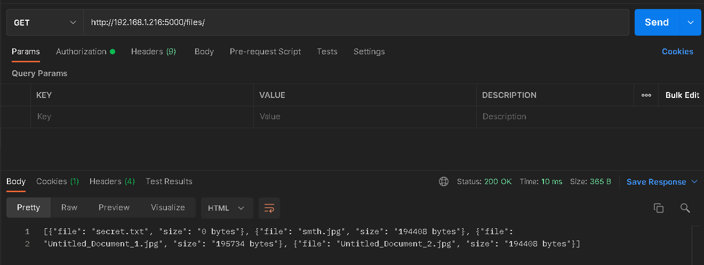
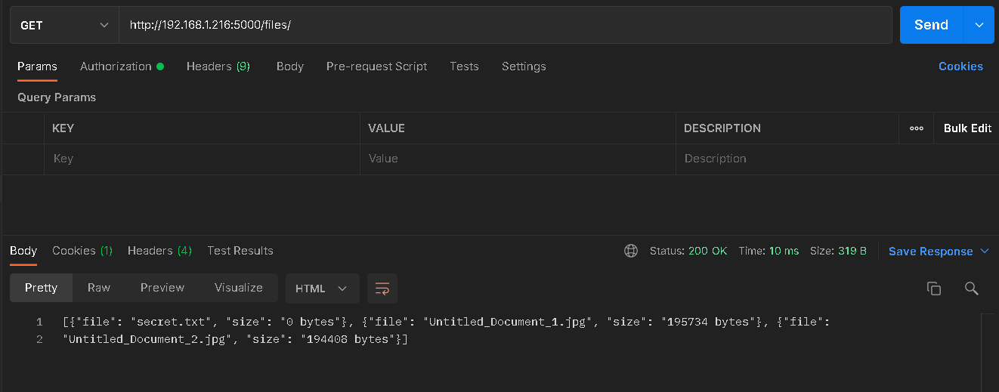

# REST API server (w/ File Storage)
REST API client: https://github.com/SaltySugar32/REST_API_client

---

## USER, TODO API
- ###  User registration

- ### Add task TODO

- ### Show tasks

- ### Delete task

- ### Update task

- ### Show tasks

---

## File storage API
- ### Add file

- ### Show files

- ### Download file

- ### Delete file

- ### Show files
