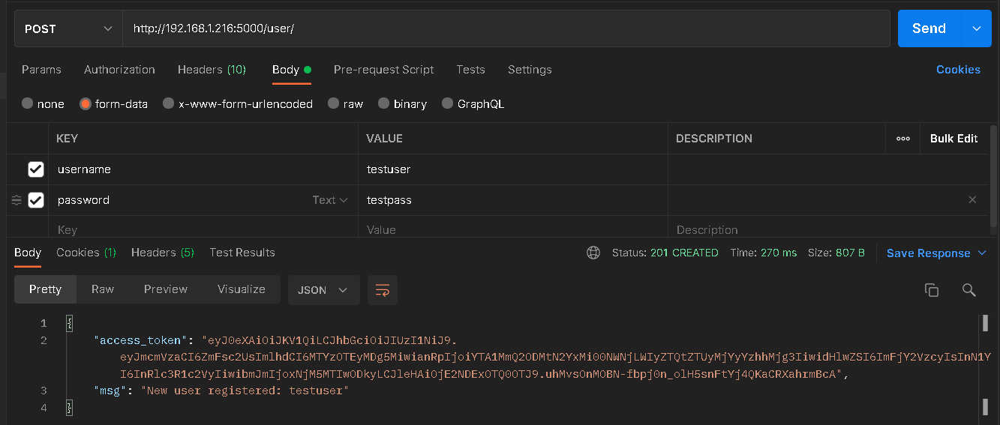
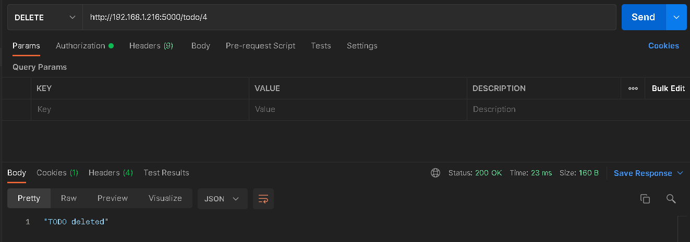
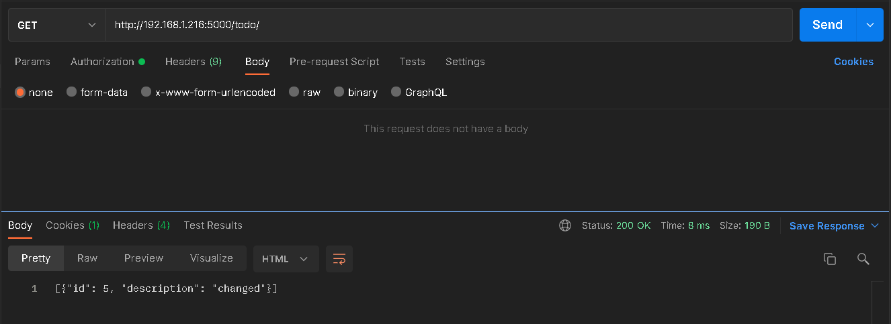

# REST API server (w/ File Storage)
REST API client https://github.com/SaltySugar32/REST_API_client

## Регистрация USER

## Добавление TODO

## Вывод списка TODO

## Удаление TODO

## Изменение TODO

## Вывод списка TODO

