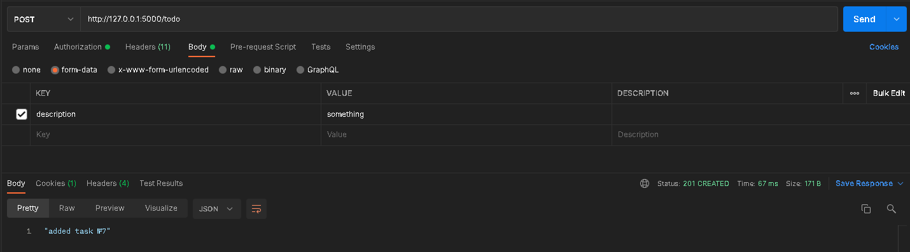
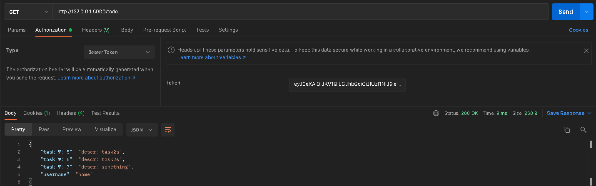
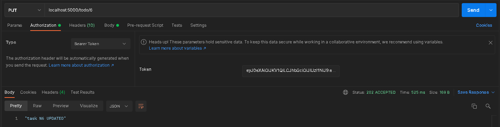
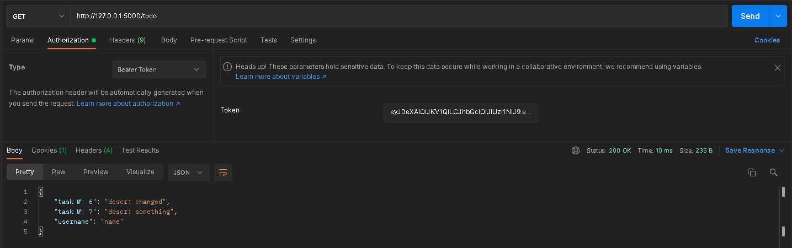

#Лабораторная работа №1. Реализация простого Rest API с использованием фреймворка 

## Регистрация USER

## Добавление TODO

## Вывод списка TODO

## Удаление TODO

## Изменение TODO

## Вывод списка TODO

