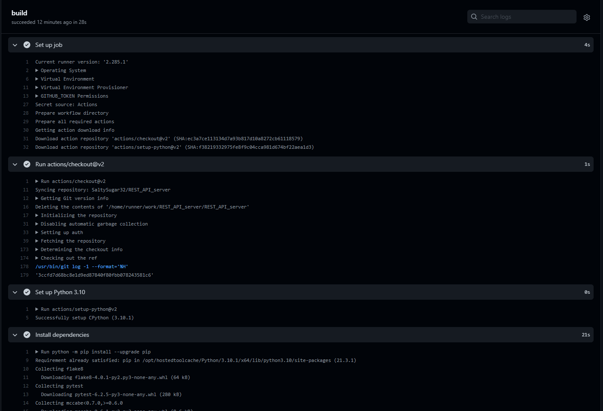
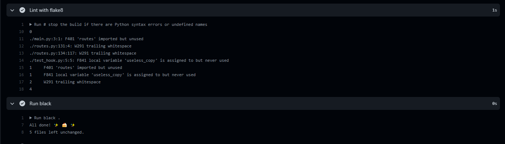
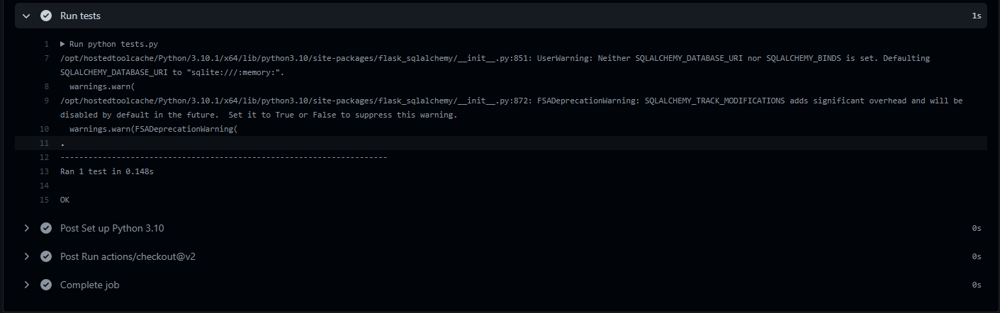
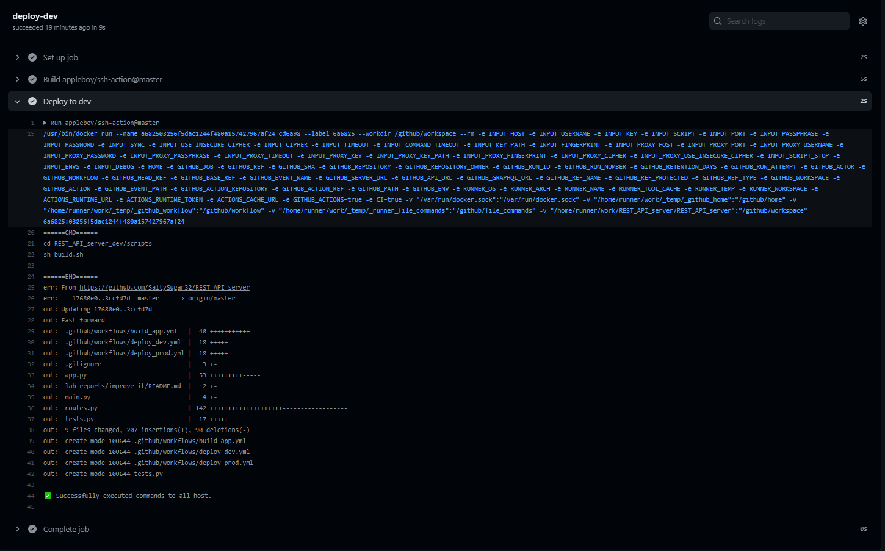
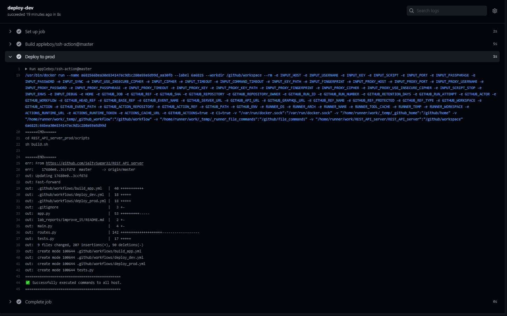

## CI/CD pipeline Report

---

### Workflow build_app
- Runs on commit.
- Installs all dependencies.

- Uses Flake8 and black tools

- Runs unit tests

### Workflow deploy_dev
- Runs on demand.
- Deploys dev environment to server via SSH

### Workflow deploy_prod
- Runs on demand.
- Deploys prod environment to server via SSH
