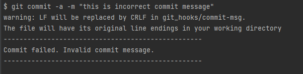
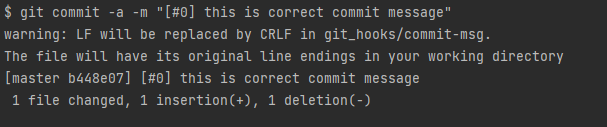
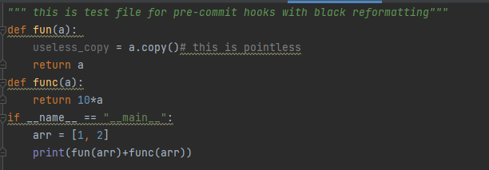
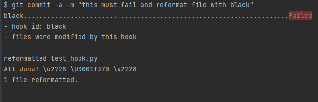
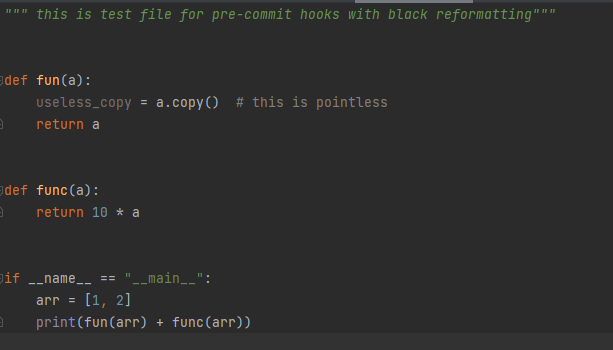
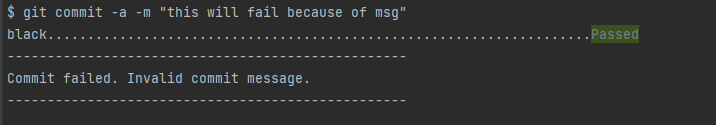
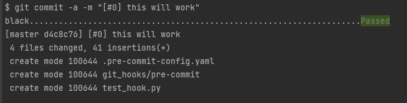
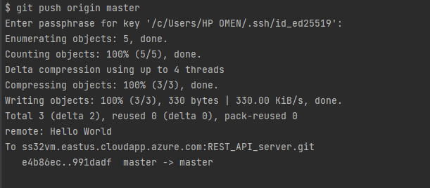

## Git Hooks Report

---

## Hook commit-msg
Commit message should be: [#< num >] < text >
- ### invalid commit

- ### valid commit

---

## Hook pre-commit
All files are checked by black (See improve-it report) and formatted if needed

- ### TestFile Before

- ### commit

- ### TestFile After

- ### commit (but invalid)

- ### commit

---

## Server Hook pre-receive
echos "Hello world"

