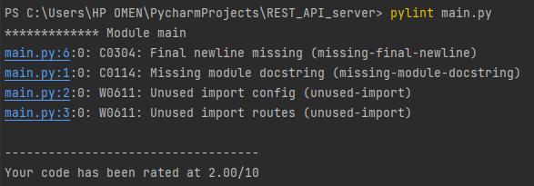
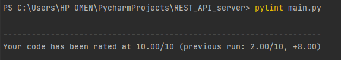
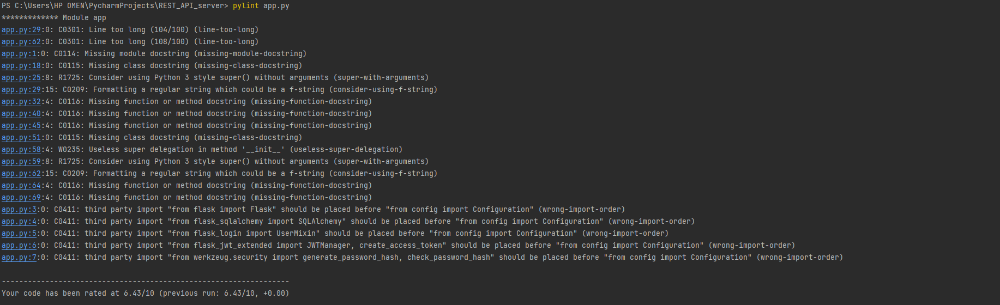
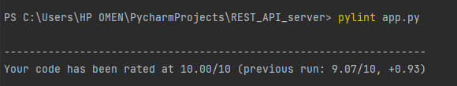
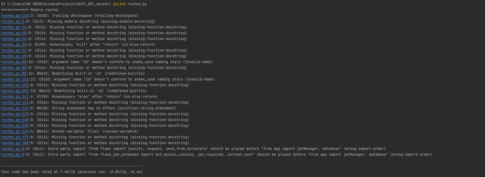
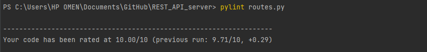
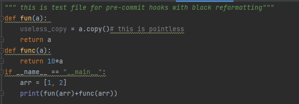
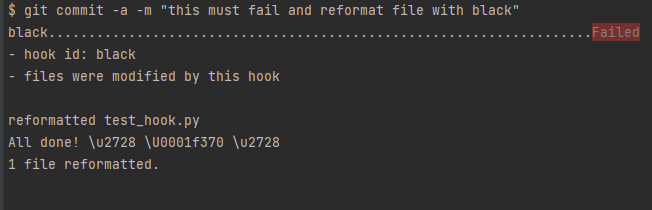

# Tools for improving quality of software

###Tools used: Pylint and black 

---

## Pylint
Pylint is a Python static code analysis tool which looks for programming 
errors, helps enforcing a coding standard, sniffs for code smells and 
offers simple refactoring suggestions.

## main.py
- ### Before

- ### After

## app.py
- ### Before

- ### After

## routes.py
- ### Before

- ### After

---

## Black
Black is the uncompromising Python code formatter. 
By using it, you agree to cede control over minutiae of hand-formatting. 
In return, Black gives you speed, determinism, and freedom from 
pycodestyle nagging about formatting. You will save time and mental energy 
for more important matters.

## Test File
- ### Before

- ### black reformat 

- ### After
